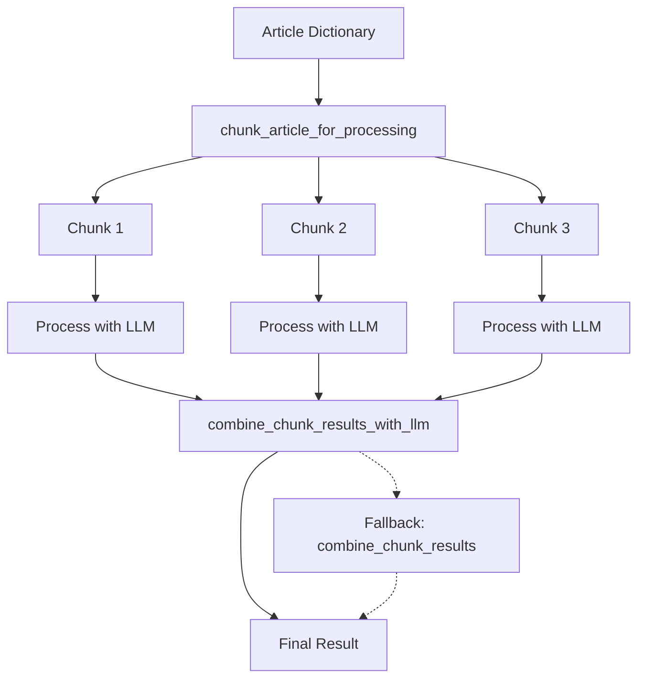

# Chunking System Documentation

## Overview

The chunking system is a critical component of the article generation pipeline that enables the processing of large articles that would otherwise exceed the context window limits of LLM models. This document provides a comprehensive explanation of how the chunking system works, from start to finish, including the recent improvements that use LLMs to intelligently combine chunks.

## Table of Contents

1. [Why Chunking is Necessary](#why-chunking-is-necessary)
2. [Chunking Architecture](#chunking-architecture)
3. [The Chunking Process](#the-chunking-process)
   - [Step 1: Article Preparation](#step-1-article-preparation)
   - [Step 2: Chunking the Article](#step-2-chunking-the-article)
   - [Step 3: Processing Individual Chunks](#step-3-processing-individual-chunks)
   - [Step 4: Combining Results with LLM](#step-4-combining-results-with-llm)
4. [Implementation Details](#implementation-details)
   - [Chunking Utilities](#chunking-utilities)
   - [LLM-Based Chunk Combination](#llm-based-chunk-combination)
   - [Token Usage Analysis](#token-usage-analysis)
5. [Configuration Options](#configuration-options)
6. [Error Handling and Fallbacks](#error-handling-and-fallbacks)
7. [Usage Examples](#usage-examples)
8. [Performance Considerations](#performance-considerations)
9. [Advanced Techniques](#advanced-techniques)
10. [Troubleshooting](#troubleshooting)

## Why Chunking is Necessary

Large Language Models (LLMs) have a fixed context window size, which limits the amount of text they can process at once. For example:

- GPT-3.5 Turbo: ~4,096 tokens (~16,000 characters)
- GPT-4: ~8,192 tokens (~32,000 characters)
- GPT-4 Turbo: ~128,000 tokens (~512,000 characters)
- Claude-3-Opus: ~200,000 tokens (~800,000 characters)
- Claude-3-Sonnet: ~100,000 tokens (~400,000 characters)
- Claude-3-Haiku: ~48,000 tokens (~192,000 characters)

When generating summaries or key takeaways for long articles, the entire article might not fit within the model's context window. For example, a 20,000-word article could contain approximately 30,000 tokens, which exceeds the context window of most models.

Chunking solves this problem by:

1. Breaking the article into smaller, manageable pieces (chunks)
2. Processing each chunk separately
3. Intelligently combining the results

This approach allows us to process articles of any length while maintaining high-quality output. Without chunking, we would be limited to processing only articles that fit within the model's context window, or we would need to truncate longer articles, potentially losing important information.

### Real-World Example

Consider an article about climate change with 15,000 words (~22,500 tokens):

- Without chunking: The article would need to be truncated to fit within the model's context window, potentially losing important details from later sections.
- With chunking: The article could be split into 3 chunks of 5,000 words each, processed separately, and then combined into a coherent summary that captures information from the entire article.

### Benefits of Chunking

- **Scalability**: Process articles of any length
- **Completeness**: Capture information from the entire article
- **Quality**: Generate more comprehensive and balanced summaries
- **Flexibility**: Adjust chunk size based on the model's capabilities

## Chunking Architecture

The chunking system consists of three main components:

1. **Chunk Article Function**: Splits an article into manageable chunks
2. **Processing Functions**: Generate summaries or keynotes for each chunk
3. **Combination Functions**: Merge the results from all chunks



### System Components in Detail

#### 1. Article Input

The system starts with an article dictionary containing:
- Title
- Introduction
- Sections (array of content)
- Conclusion

#### 2. Chunking Function

The `chunk_article_for_processing` function:
- Analyzes the article's total length
- Determines if chunking is necessary
- Creates chunks with appropriate overlap
- Preserves article structure within each chunk

#### 3. Processing Functions

For each chunk:
- Formats the chunk content into a prompt
- Sends the prompt to the appropriate LLM
- Captures the generated summary or keynotes
- Handles any errors or rate limiting

#### 4. Combination Function

The `combine_chunk_results_with_llm` function:
- Takes all chunk results as input
- Creates a meta-prompt for the LLM
- Asks the LLM to intelligently combine the chunks
- Handles deduplication, coherence, and flow
- Falls back to simpler methods if needed

## The Chunking Process

### Step 1: Article Preparation

Before chunking, the article is prepared as a dictionary with the following structure:

```python
article_dict = {
    'title': 'Article Title',
    'introduction': 'Introduction text...',
    'sections': ['Section 1 content...', 'Section 2 content...', ...],
    'conclusion': 'Conclusion text...'
}
```

### Step 2: Chunking the Article

The `chunk_article_for_processing` function splits the article into chunks:

```python
def chunk_article_for_processing(
    article_dict: Dict[str, Any],
    chunk_size: int = 8000,
    overlap: int = 500
) -> List[Dict[str, Any]]:
    """
    Split an article into chunks for processing by LLMs with limited context windows.

    Args:
        article_dict: Dictionary containing article parts
        chunk_size: Maximum size of each chunk in characters
        overlap: Number of characters to overlap between chunks

    Returns:
        List of article chunk dictionaries
    """
```

The function works as follows:

1. First, it checks if the article is small enough to fit within a single chunk
2. If so, it returns the article as a single chunk
3. If not, it splits the article into multiple chunks:
   - Each chunk maintains the article's title for context
   - The introduction goes into the first chunk
   - Sections are distributed across chunks
   - If a section is too large for a single chunk, it's split across multiple chunks
   - The conclusion goes into the last chunk
   - Chunks have overlap to maintain context between them

### Step 3: Processing Individual Chunks

Each chunk is processed separately to generate either a summary or keynotes:

For summaries:
```python
# Process each chunk
for i, chunk in enumerate(article_chunks):
    # Create a prompt for the chunk
    prompt = summarize_prompt.format(
        keyword=keyword,
        articleaudience=context.articleaudience,
        article_content=full_content,
    )

    # Generate summary for this chunk
    chunk_summary = generate_with_llm(prompt)
    chunk_results.append(chunk_summary)
```

For keynotes:
```python
# Process each chunk
for i, chunk in enumerate(article_chunks):
    # Create a prompt for the chunk
    prompt = blocknote_prompt.format(
        article_content=article_text,
        keyword=article_content.get('keyword', 'this topic')
    )

    # Generate keynotes for this chunk
    chunk_keynotes = generate_with_llm(prompt)
    chunk_results.append(chunk_keynotes)
```

### Step 4: Combining Results with LLM

The most innovative part of the system is using the LLM itself to combine the results from all chunks. This is handled by the `combine_chunk_results_with_llm` function:

```python
def combine_chunk_results_with_llm(
    results: List[str],
    context,
    is_summary: bool = True
) -> str:
    """
    Combine results from processing multiple chunks using the LLM itself.

    Args:
        results: List of text results from processing each chunk
        context: The ArticleContext object containing configuration
        is_summary: Whether this is for summary (True) or keynotes (False)

    Returns:
        Combined result that is coherent and non-repetitive
    """
```

The function:

1. Formats all chunk results into a single prompt
2. Asks the LLM to merge them into a coherent, non-repetitive result
3. Uses the same model that was used to generate the summaries/keynotes
4. Falls back to a simpler method if there's an error

## Implementation Details

### Chunking Utilities

The chunking utilities are implemented in:
- `script1/article_generator/chunking_utils.py`
- `script2/article_generator/chunking_utils.py`

Both implementations are nearly identical and contain three main functions:

1. `chunk_article_for_processing`: Splits an article into chunks
2. `combine_chunk_results`: A simple method to combine chunks (used as fallback)
3. `combine_chunk_results_with_llm`: The LLM-based method to combine chunks

#### Detailed Implementation of `chunk_article_for_processing`

```python
def chunk_article_for_processing(
    article_dict: Dict[str, Any],
    chunk_size: int = 8000,
    overlap: int = 500
) -> List[Dict[str, Any]]:
    """Split an article into chunks for processing by LLMs with limited context windows."""

    # Check if article is small enough to process in one chunk
    full_content = (
        f"Title: {article_dict.get('title', '')}\n\n"
        f"Introduction: {article_dict.get('introduction', '')}\n\n"
    )

    # Add sections
    if isinstance(article_dict.get('sections', []), list):
        for i, section in enumerate(article_dict.get('sections', [])):
            full_content += f"Section {i+1}: {section}\n\n"

    # Add conclusion
    full_content += f"Conclusion: {article_dict.get('conclusion', '')}"

    # If content is small enough, return as single chunk
    if len(full_content) <= chunk_size:
        return [article_dict]

    # Otherwise, split into chunks
    chunks = []
    current_chunk = {
        "title": article_dict.get('title', ''),
        "introduction": "",
        "sections": [],
        "conclusion": ""
    }
    current_size = len(article_dict.get('title', ''))

    # Process introduction
    intro = article_dict.get('introduction', '')
    if current_size + len(intro) <= chunk_size:
        current_chunk["introduction"] = intro
        current_size += len(intro)
    else:
        # Split introduction if needed
        current_chunk["introduction"] = intro[:chunk_size - current_size]

    # Process sections with overlap logic
    if isinstance(article_dict.get('sections', []), list):
        for section in article_dict.get('sections', []):
            if current_size + len(section) <= chunk_size:
                # Section fits in current chunk
                current_chunk["sections"].append(section)
                current_size += len(section)
            else:
                # Section doesn't fit, start a new chunk
                if current_chunk["introduction"] or current_chunk["sections"]:
                    chunks.append(current_chunk)

                    # Create new chunk with overlap
                    overlap_sections = []
                    if current_chunk["sections"]:
                        # Include the last section from previous chunk for context
                        overlap_sections = current_chunk["sections"][-1:]

                    current_chunk = {
                        "title": article_dict.get('title', ''),
                        "introduction": "",
                        "sections": overlap_sections,
                        "conclusion": ""
                    }
                    current_size = len(article_dict.get('title', '')) + sum(len(s) for s in overlap_sections)

                # Handle large sections that exceed chunk size
                if len(section) <= chunk_size:
                    current_chunk["sections"].append(section)
                    current_size += len(section)
                else:
                    # Split the section itself
                    section_parts = []
                    for i in range(0, len(section), chunk_size - overlap):
                        part = section[i:i + chunk_size - overlap]
                        section_parts.append(part)

                    # Add first part to current chunk
                    current_chunk["sections"].append(section_parts[0])
                    current_size += len(section_parts[0])

                    # Create new chunks for remaining parts
                    for part in section_parts[1:]:
                        chunks.append(current_chunk)
                        current_chunk = {
                            "title": article_dict.get('title', ''),
                            "introduction": "",
                            "sections": [part],
                            "conclusion": ""
                        }
                        current_size = len(article_dict.get('title', '')) + len(part)

    # Handle conclusion
    conclusion = article_dict.get('conclusion', '')
    if current_size + len(conclusion) <= chunk_size:
        current_chunk["conclusion"] = conclusion
    else:
        # Add current chunk and create a final one for conclusion
        chunks.append(current_chunk)
        current_chunk = {
            "title": article_dict.get('title', ''),
            "introduction": "",
            "sections": [],
            "conclusion": conclusion
        }

    # Add the final chunk
    chunks.append(current_chunk)

    return chunks
```

### LLM-Based Chunk Combination

The LLM-based combination function is the heart of the improved chunking system. It leverages the same ArticleContext object that's used throughout the article generation process, ensuring consistency in configuration and model selection.

#### ArticleContext Integration

The `ArticleContext` class plays a crucial role in the chunking system:

1. It provides access to all configuration parameters
2. It maintains consistency between the initial generation and the combination step
3. It ensures the same API keys, models, and settings are used throughout the process

This integration means that if you configure a specific model for summaries in the context, that same model will be used for combining chunks, maintaining consistency in tone and style.

#### Implementation Details

Here's the complete implementation showing how the context is used:

```python
def combine_chunk_results_with_llm(
    results: List[str],
    context,  # This is the ArticleContext object containing all configuration
    is_summary: bool = True
) -> str:
    """Combine results from processing multiple chunks using the LLM itself."""

    if len(results) == 1:
        return results[0]

    try:
        # Determine if we should use a separate model - using context.config
        use_separate_model = (
            hasattr(context.config, 'enable_separate_summary_model') and
            context.config.enable_separate_summary_model and
            hasattr(context.config, 'summary_keynotes_model') and
            context.config.summary_keynotes_model
        )

        # Format the chunks for the LLM
        chunks_text = ""
        for i, result in enumerate(results):
            chunks_text += f"CHUNK {i+1}:\n{result}\n\n"

        # Create the prompt for the LLM
        content_type = "summary" if is_summary else "key takeaways"
        prompt = f"""
You are tasked with combining multiple chunks of article {content_type} into a single coherent result.
Each chunk below contains a {content_type} generated from a portion of the same article.
Your job is to merge these chunks into a single, well-structured {content_type} that:
1. Eliminates all repetition
2. Maintains all unique information
3. Flows naturally as a cohesive piece
4. Is well-organized and logically structured
5. Maintains the same tone and style as the original chunks

Here are the chunks to combine:

{chunks_text}

Please provide a single, coherent {content_type} that effectively combines all the information from these chunks.
"""

        # Get the appropriate max tokens
        if is_summary:
            max_tokens = getattr(context.config, 'summary_max_tokens', 800)
        else:
            max_tokens = getattr(context.config, 'keynotes_max_tokens', 300)

        # Use the appropriate model to combine the chunks - using context.config for model selection
        if use_separate_model and context.config.use_openrouter:
            # Use OpenRouter with the specified model from context.config
            from article_generator.content_generator import make_openrouter_api_call

            # Create messages for the API call
            messages = [
                {"role": "system", "content": f"You are an expert at combining multiple article {content_type} chunks into a single coherent result."},
                {"role": "user", "content": prompt}
            ]

            # Make the API call using configuration from context
            response = make_openrouter_api_call(
                messages=messages,
                model=context.config.summary_keynotes_model,  # Using the model specified in context
                api_key=context.config.openrouter_api_key,    # Using API key from context
                site_url=context.config.openrouter_site_url,  # Using site URL from context
                site_name=context.config.openrouter_site_name, # Using site name from context
                temperature=0.3,  # Lower temperature for more deterministic results
                max_tokens=max_tokens
            )

            combined = response.choices[0].message.content.strip()
        else:
            # Use the standard OpenAI API with configuration from context
            import openai
            from article_generator.rate_limiter import openai_rate_limiter

            # Determine the engine to use from context.config
            engine = context.config.openai_model  # Using the model specified in context

            # Check rate limiting settings from context
            if context.config.enable_rate_limiting and openai_rate_limiter:
                # Define the API call function with rate limiting
                def make_api_call():
                    return openai.chat.completions.create(
                        model=engine,  # Using the model from context
                        messages=[
                            {"role": "system", "content": f"You are an expert at combining multiple article {content_type} chunks into a single coherent result."},
                            {"role": "user", "content": prompt}
                        ],
                        temperature=0.3,
                        max_tokens=max_tokens  # Using max tokens from context
                    )

                # Execute with rate limiting based on context settings
                response = openai_rate_limiter.execute_with_rate_limit(make_api_call)
            else:
                # Execute without rate limiting
                response = openai.chat.completions.create(
                    model=engine,  # Using the model from context
                    messages=[
                        {"role": "system", "content": f"You are an expert at combining multiple article {content_type} chunks into a single coherent result."},
                        {"role": "user", "content": prompt}
                    ],
                    temperature=0.3,
                    max_tokens=max_tokens  # Using max tokens from context
                )

            combined = response.choices[0].message.content.strip()

        return combined

    except Exception as e:
        # Fall back to the simple method if the LLM approach fails
        return combine_chunk_results(results)
```

### Token Usage Analysis

The chunking system has significant implications for token usage:

#### Token Usage Breakdown

For an article that requires chunking into 3 parts:

1. **Without LLM Combination**:
   - Input tokens for chunk 1: ~2,000 tokens
   - Input tokens for chunk 2: ~2,000 tokens
   - Input tokens for chunk 3: ~2,000 tokens
   - Output tokens (3 summaries): ~1,200 tokens
   - **Total**: ~7,200 tokens

2. **With LLM Combination**:
   - Input tokens for chunk 1: ~2,000 tokens
   - Input tokens for chunk 2: ~2,000 tokens
   - Input tokens for chunk 3: ~2,000 tokens
   - Output tokens (3 summaries): ~1,200 tokens
   - Input tokens for combination: ~1,500 tokens (includes all 3 summaries + prompt)
   - Output tokens for combination: ~500 tokens
   - **Total**: ~9,200 tokens

While the LLM combination approach uses approximately 28% more tokens, the quality improvement is substantial. The combined summary is more coherent, has better flow, and eliminates repetition that would otherwise appear when simply concatenating the individual summaries.

## Configuration Options

The chunking system can be configured through several parameters in the ArticleContext object:

| Parameter | Description | Default Value | Used By | Optimal Setting |
|-----------|-------------|---------------|---------|----------------|
| `summary_chunk_size` | Chunk size for summary generation | 10,000 characters | Chunking function | 80% of model's context window |
| `keynotes_chunk_size` | Chunk size for keynotes generation | 10,000 characters | Chunking function | 80% of model's context window |
| `chunk_overlap` | Overlap between chunks | 500 characters | Chunking function | 5-10% of chunk size |
| `enable_separate_summary_model` | Whether to use a separate model for summaries/keynotes | Varies by config | Both generation and combination |
| `summary_keynotes_model` | Model to use for summaries/keynotes | Varies by config | Both generation and combination |
| `use_openrouter` | Whether to use OpenRouter API | Varies by config | Both generation and combination |
| `openrouter_api_key` | API key for OpenRouter | From .env file | Both generation and combination |
| `openrouter_site_url` | Site URL for OpenRouter | Varies by config | Both generation and combination |
| `openrouter_site_name` | Site name for OpenRouter | Varies by config | Both generation and combination |
| `openai_model` | Default OpenAI model to use | Varies by config | Both generation and combination |
| `enable_rate_limiting` | Whether to use rate limiting | Varies by config | Both generation and combination |
| `summary_max_tokens` | Maximum tokens for summary | 800 | Both generation and combination |
| `keynotes_max_tokens` | Maximum tokens for keynotes | 300 | Both generation and combination |

These parameters can be set in the configuration files:
- `script1/config.py`
- `script2/config.py`

### ArticleContext Class

The ArticleContext class is central to the chunking system, providing a consistent configuration across all operations:

```python
class ArticleContext:
    """
    Context object for article generation, containing all necessary configuration and state.

    This ensures that the same configuration is used throughout the article generation process,
    including during chunking and chunk combination.
    """

    def __init__(self, config, **kwargs):
        self.config = config
        self.articleaudience = kwargs.get('articleaudience', '')
        self.keyword = kwargs.get('keyword', '')
        # Additional properties as needed
```

This context object is passed to both the initial generation functions and the chunk combination function, ensuring that the same configuration (including model selection, API keys, and other settings) is used consistently throughout the process.

## Error Handling and Fallbacks

The chunking system includes robust error handling:

1. If the LLM-based combination fails, it falls back to the simple combination method
2. If a chunk fails to process, it's skipped and the system continues with the remaining chunks
3. If all chunks fail, an empty string is returned

```python
try:
    # LLM-based combination logic
    combined = llm_combine(chunks)
    return combined
except Exception as e:
    logger.error(f"Error combining chunks with LLM: {str(e)}")
    logger.warning("Falling back to simple chunk combination method")
    # Fall back to the simple method if the LLM approach fails
    return combine_chunk_results(results)
```

## Usage Examples

### Generating a Summary

```python
# Prepare the article
article_dict = {
    'title': article_components['title'],
    'introduction': article_components['introduction'],
    'sections': article_components['sections'],
    'conclusion': article_components['conclusion']
}

# Chunk the article
article_chunks = chunk_article_for_processing(article_dict, chunk_size=chunk_size)

# Process each chunk
chunk_results = []
for chunk in article_chunks:
    chunk_summary = generate_summary_for_chunk(chunk)
    chunk_results.append(chunk_summary)

# Combine results using LLM
if len(chunk_results) > 1:
    summary = combine_chunk_results_with_llm(chunk_results, context, is_summary=True)
else:
    summary = chunk_results[0]
```

### Generating Keynotes

```python
# Chunk the article
article_chunks = chunk_article_for_processing(article_content, chunk_size=chunk_size)

# Process each chunk
chunk_results = []
for chunk in article_chunks:
    chunk_keynotes = generate_keynotes_for_chunk(chunk)
    chunk_results.append(chunk_keynotes)

# Combine results using LLM
if len(chunk_results) > 1:
    block_notes = combine_chunk_results_with_llm(chunk_results, context, is_summary=False)
else:
    block_notes = chunk_results[0]
```

## Performance Considerations

The chunking system has several performance implications:

1. **API Costs**: Processing multiple chunks increases the number of API calls
2. **Time**: Processing chunks sequentially takes longer than a single call
3. **Quality**: The LLM-based combination significantly improves output quality

### Cost-Benefit Analysis

| Aspect | Without Chunking | With Simple Chunking | With LLM Chunking |
|--------|------------------|----------------------|-------------------|
| Token Usage | Lower (if article fits) | Medium | Higher |
| API Calls | 1 | N (number of chunks) | N+1 |
| Processing Time | Fastest | Medium | Slowest |
| Quality | Good (for small articles) | Medium (repetition issues) | Excellent |
| Max Article Size | Limited by context window | Unlimited | Unlimited |

### Optimization Strategies

1. **Optimal Chunk Sizing**:
   - Ideally, set chunk size close to the model's maximum context window size
   - This maximizes efficiency by getting the most out of each API call
   - Leave some buffer for the prompt and system instructions (typically 20%)
   - Example: `chunk_size = model_context_size * 0.8`

   For specific models:
   - GPT-3.5-Turbo: ~3,000 tokens (~12,000 characters)
   - GPT-4: ~6,500 tokens (~26,000 characters)
   - Claude-3-Opus: ~160,000 tokens (~640,000 characters)
   - Claude-3-Sonnet: ~80,000 tokens (~320,000 characters)

2. **Model Selection via ArticleContext**:
   - Use models with larger context windows for fewer chunks
   - Use more efficient models for the combination step
   - Configure this in the ArticleContext for consistency
   - Example: Use Claude-3-Opus for initial generation and Claude-3-Haiku for combination

3. **Parallel Processing**:
   - Process chunks in parallel to reduce total time
   - Implementation example:
     ```python
     import concurrent.futures

     def process_chunks_parallel(chunks, process_func, max_workers=3):
         results = []
         with concurrent.futures.ThreadPoolExecutor(max_workers=max_workers) as executor:
             future_to_chunk = {executor.submit(process_func, chunk): chunk for chunk in chunks}
             for future in concurrent.futures.as_completed(future_to_chunk):
                 try:
                     result = future.result()
                     results.append(result)
                 except Exception as e:
                     logger.error(f"Error processing chunk: {str(e)}")
         return results
     ```

4. **Caching**:
   - Cache results for frequently processed articles
   - Implement a TTL (time-to-live) cache to refresh content periodically

5. **Context-Aware Processing**:
   - The ArticleContext ensures the same configuration is used throughout
   - This maintains consistency in model selection, API keys, and other settings
   - Example: If you set `context.config.summary_keynotes_model = "claude-3-opus-20240229"`, this model will be used for both generation and combination

## Advanced Techniques

### Semantic Chunking

Instead of chunking based purely on character count, semantic chunking splits the article at logical boundaries:

```python
def semantic_chunk_article(article_dict):
    """Split article at semantic boundaries like section breaks."""
    chunks = []
    current_chunk = {"title": article_dict["title"], "sections": []}

    # Group sections by topic similarity
    for section in article_dict["sections"]:
        # If current chunk is getting too large or topic changes significantly
        if should_start_new_chunk(current_chunk, section):
            chunks.append(current_chunk)
            current_chunk = {"title": article_dict["title"], "sections": []}

        current_chunk["sections"].append(section)

    # Add the last chunk
    if current_chunk["sections"]:
        chunks.append(current_chunk)

    return chunks
```

### Progressive Summarization

For extremely large articles, implement a hierarchical approach:

1. Split into many small chunks
2. Generate summaries for each chunk
3. Group these summaries into second-level chunks
4. Generate summaries of summaries
5. Combine the high-level summaries

This approach works well for articles with 50,000+ words.

## Troubleshooting

### Common Issues and Solutions

| Issue | Possible Cause | Solution |
|-------|---------------|----------|
| Repetitive content in final output | Simple combination method being used | Ensure LLM combination is working properly |
| Missing information from later sections | Chunk size too small | Increase chunk size to match model's context window or add more overlap |
| Error in LLM combination | Rate limiting or token limits | Implement exponential backoff retry logic |
| Inconsistent tone across chunks | Different models used for different chunks | Use the same model for all chunks via ArticleContext |
| High API costs | Too many small chunks | Increase chunk size to match model's context window, use models with larger context windows |

### Debugging Tips

1. **Log Chunk Sizes**:
   ```python
   for i, chunk in enumerate(chunks):
       chunk_size = len(str(chunk))
       logger.debug(f"Chunk {i+1}: {chunk_size} characters")
   ```

2. **Visualize Chunk Boundaries**:
   ```python
   def visualize_chunks(article_dict, chunks):
       """Create a visual representation of how the article was chunked."""
       full_text = article_to_text(article_dict)
       chunk_texts = [article_to_text(chunk) for chunk in chunks]

       # Create a visualization showing where each chunk starts and ends
       # Return as HTML or text representation
   ```

3. **Compare Outputs**:
   ```python
   def compare_combination_methods(chunks):
       """Compare simple vs LLM combination methods."""
       simple_result = combine_chunk_results(chunks)
       llm_result = combine_chunk_results_with_llm(chunks, context)

       # Compare length, unique sentences, readability scores
       return {
           "simple_length": len(simple_result),
           "llm_length": len(llm_result),
           "simple_readability": calculate_readability(simple_result),
           "llm_readability": calculate_readability(llm_result),
           "overlap_percentage": calculate_overlap(simple_result, llm_result)
       }
   ```

## Conclusion

The chunking system with LLM-based combination represents a significant advancement in handling large articles for summarization and keynotes generation. By intelligently splitting content and then using the same LLM to merge the results, we achieve:

1. **Scalability**: Process articles of any length
2. **Quality**: Generate coherent, non-repetitive summaries
3. **Flexibility**: Support various models and configurations
4. **Robustness**: Handle errors gracefully with fallback mechanisms
5. **Consistency**: Maintain the same configuration throughout via ArticleContext

The ArticleContext object plays a crucial role in ensuring that the same configuration (including model selection, API keys, and other settings) is used consistently throughout the process. This maintains coherence and quality across all operations.

This system is used consistently across both script1 and script2, providing a unified approach to content processing throughout the codebase. The LLM-based combination method in particular demonstrates how LLMs can be used not just for content generation but also for content refinement and integration.

For future enhancements, consider implementing semantic chunking, parallel processing, and adaptive chunk sizing to further optimize the system for specific use cases and content types. The ArticleContext architecture provides a solid foundation for these enhancements, allowing for easy configuration and extension.
