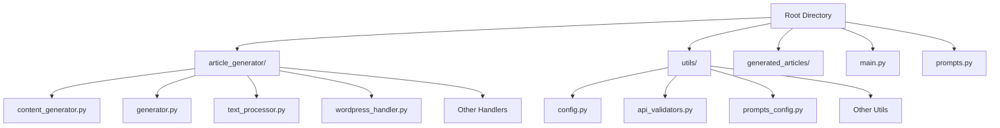
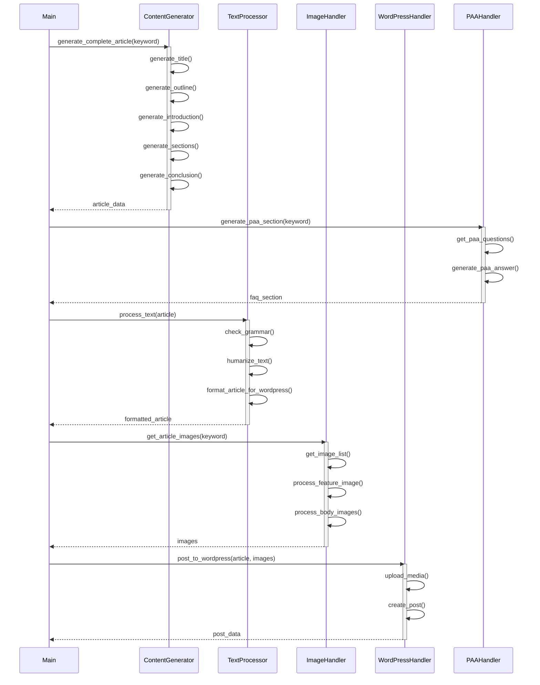
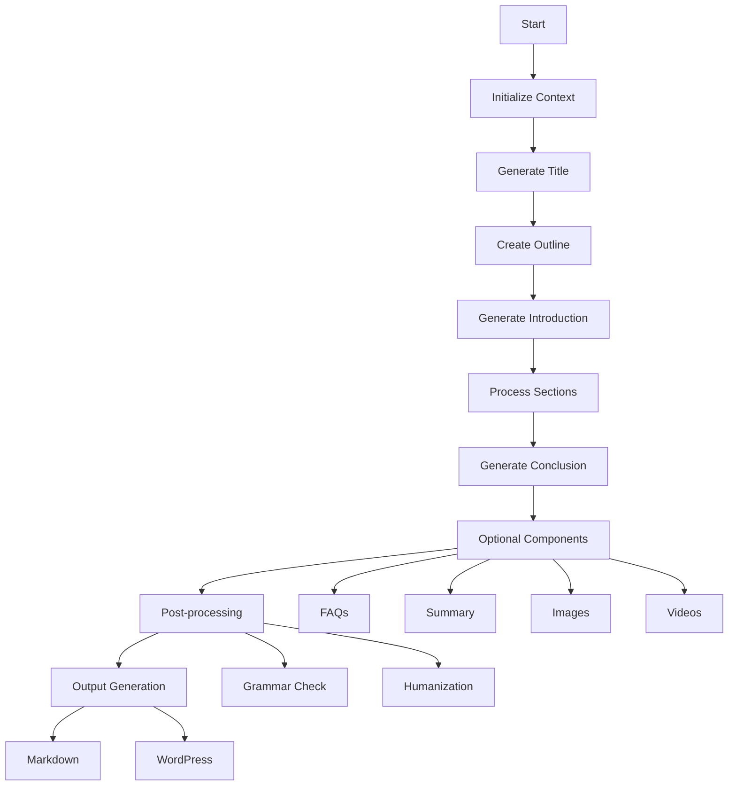

# AI Article Generation System Documentation

## Table of Contents
- [Overview](#overview)
- [Project Structure](#project-structure)
- [System Architecture](#system-architecture)
- [Core Components](#core-components)
- [Configuration](#configuration)
- [Article Generation Flow](#article-generation-flow)
- [Handlers and Utilities](#handlers-and-utilities)
- [API Integration](#api-integration)
- [Error Handling and Logging](#error-handling-and-logging)
- [Best Practices](#best-practices)

## Overview

The AI Article Generation System is a sophisticated content creation platform that leverages OpenAI's GPT models to generate high-quality, SEO-optimized articles. The system supports multiple output formats (Markdown and WordPress), handles various content components (FAQs, summaries, images, videos), and includes extensive configuration options for customization.

### Key Features

- Automated article generation with structured sections
- SEO optimization with meta descriptions and keywords
- Multi-format output (Markdown and WordPress)
- Image and YouTube video integration
- FAQ and "People Also Ask" sections
- Block notes and key takeaways
- Grammar checking and text humanization
- Configurable article structure and style
- Progress tracking and logging
- API integration (OpenAI, WordPress, YouTube, Image APIs)

## Project Structure



### Directory Structure
```
.
├── article_generator/
│   ├── content_generator.py
│   ├── generator.py
│   ├── text_processor.py
│   ├── wordpress_handler.py
│   ├── faq_handler.py
│   ├── external_links_handler.py
│   ├── paa_handler.py
│   ├── meta_handler.py
│   ├── logger.py
│   ├── image_handler.py
│   └── youtube_handler.py
├── utils/
│   ├── config.py
│   ├── api_validators.py
│   ├── prompts_config.py
│   ├── file_utils.py
│   └── text_utils.py
├── generated_articles/
├── main.py
└── prompts.py
```

## System Architecture



## Core Components

### ArticleContext Class (`content_generator.py`)
The `ArticleContext` class manages the state and context of article generation:

```python
@dataclass
class ArticleContext:
    config: Config  # Configuration settings
    openai_engine: str
    max_context_window_tokens: int
    token_padding: int
    track_token_usage: bool
    warn_token_threshold: float
    section_token_limit: int
    paragraphs_per_section: int
    min_paragraph_tokens: int
    max_paragraph_tokens: int
    size_headings: int
    size_sections: int
    articletype: str
    articlelanguage: str
    voicetone: str
    pointofview: str
    articleaudience: str = "General"
```

Key features:
- Token tracking and management
- Message history maintenance
- Context window optimization
- Article component storage
- Configuration management

### Generator Class (`generator.py`)
The central orchestrator of the article generation process:

```python
class Generator:
    def __init__(self, config: Config, prompts: Prompts):
        self.config = config
        self.prompts = prompts
        self.meta_handler = MetaHandler(config, openai, prompts)
        self.image_config = ImageConfig(...)
```

Key responsibilities:
- Initializes and validates the environment
- Orchestrates the article generation process
- Manages content generation flow
- Handles post-processing (grammar, humanization)
- Manages output formats (Markdown, WordPress)

## Article Generation Flow



### Process Steps:
1. **Initialization**
   - Load configuration and prompts
   - Set up API clients (OpenAI, YouTube, WordPress)
   - Initialize ArticleContext with settings

2. **Content Generation**
   - Generate SEO-optimized title
   - Create structured outline
   - Generate engaging introduction
   - Process main content sections
   - Create conclusion
   - Generate article summary

3. **Enhancement Components**
   - FAQ generation using OpenAI
   - PAA section using SerpAPI
   - Block notes and key takeaways
   - External links integration
   - Image selection and processing
   - YouTube video embedding

4. **Post-processing**
   - Grammar checking with OpenAI
   - Text humanization for natural flow
   - Token usage optimization
   - Format conversion for output

5. **Output Generation**
   - Markdown file creation
   - WordPress post formatting
   - Meta content generation
   - Media upload handling

## Handlers and Utilities

### Text Processing (`text_processor.py`)
- Text humanization with OpenAI
- Grammar checking and correction
- Format conversion (Markdown ↔ WordPress)
- NLTK-based sentence splitting
- Content optimization

### Media Handlers
1. **Image Handler** (`image_handler.py`)
   ```python
   def get_article_images(
       keyword: str,
       config: ImageConfig,
       num_images: Optional[int] = None,
       save_dir: str = "images",
       timestamp: str = None
   ) -> Tuple[Optional[Dict[str, str]], List[Dict[str, str]]]
   ```
   - Feature image processing
   - Body image management
   - Image metadata handling
   - Local storage management

2. **YouTube Handler** (`youtube_handler.py`)
   ```python
   class YouTubeHandler:
       def search_video(self, keyword: str, max_results: int = 1)
       def get_embed_html(self, video_id: str, width: int = 560, height: int = 315)
       def get_markdown_embed(self, video_id: str)
       def get_wordpress_embed(self, video_id: str)
   ```
   - Video search and selection
   - Multiple embed format support
   - Responsive video integration

3. **PAA Handler** (`paa_handler.py`)
   ```python
   def get_paa_questions(keyword: str, serp_api_key: str) -> List[Dict[str, str]]
   def generate_paa_section(keyword: str, serp_api_key: str) -> str
   ```
   - SerpAPI integration
   - Question extraction
   - Answer formatting

4. **FAQ Handler** (`faq_handler.py`)
   ```python
   def generate_faq_section(
       context: ArticleContext,
       keyword: str,
       faq_prompt: str,
       openai_engine: str,
       enable_token_tracking: bool = False
   ) -> str
   ```
   - AI-powered FAQ generation
   - Q&A formatting
   - WordPress block integration

### WordPress Integration (`wordpress_handler.py`)
- Content formatting with Gutenberg blocks
- Media upload handling
- Post creation and management
- Meta data integration

## API Integration

### OpenAI Integration
- Model: Configurable (default: GPT-4)
- Temperature and token controls
- Context window management
- Retry mechanisms with exponential backoff

### WordPress API
- REST API integration
- Authentication handling
- Media upload management
- Post creation and updating
- Custom field support

### Additional APIs
- YouTube Data API v3
- SerpAPI for PAA content
- Image APIs (configurable)
- External link APIs

## Error Handling and Logging

### Logger Configuration (`logger.py`)
- Rich console integration
- Progress tracking with spinners
- Token usage monitoring
- Debug information logging
- Error tracking and reporting

### Error Handling
- Graceful degradation strategies
- Retry mechanisms with backoff
- API error handling
- Token limit management
- Exception logging and recovery

## Best Practices

### Content Generation
1. Maintain consistent tone and style through configuration
2. Optimize for SEO with meta descriptions
3. Ensure readability with humanization
4. Follow E-E-A-T principles in content structure

### Code Organization
1. Modular design with specialized handlers
2. Clear separation of concerns
3. Comprehensive error handling
4. Efficient token management
5. Progress tracking and logging

### Configuration
1. Use environment variables for sensitive data
2. Validate API keys and settings
3. Maintain flexibility with extensive options
4. Document all configuration parameters

### API Usage
1. Implement rate limiting and backoff
2. Handle API errors gracefully
3. Optimize token usage
4. Secure credential management
5. Cache responses when appropriate 