# بِسْمِ اللهِ الرَّحْمٰنِ الرَّحِيْمِ

# Current Article Generation Flow (2024 Configuration)

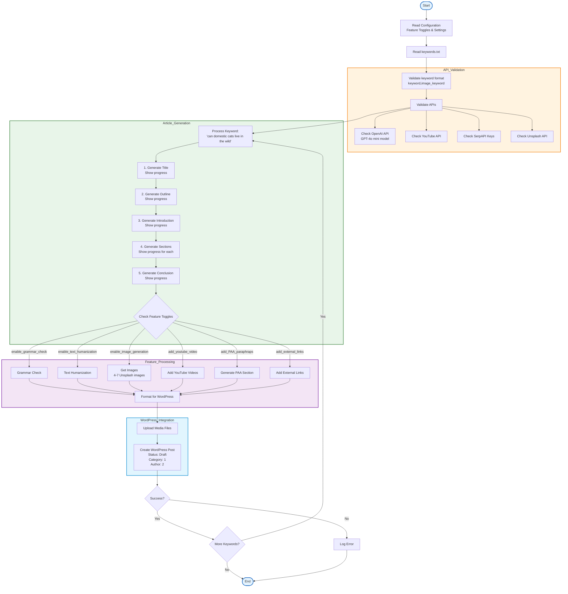

# Configuration Overview

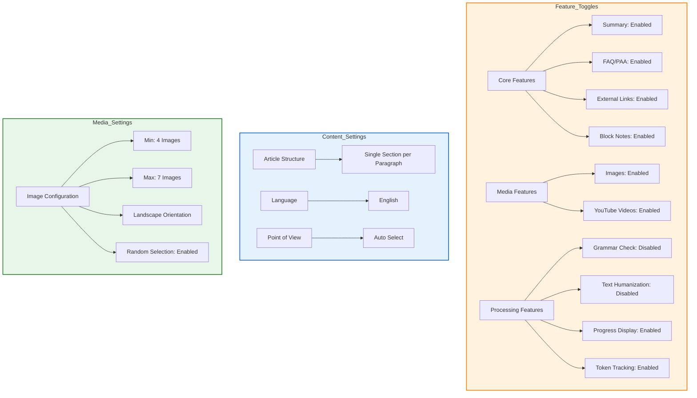

# Article Generation Settings Overview

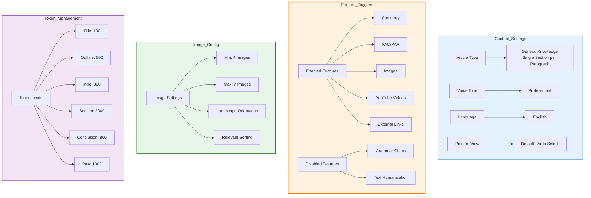

# Article Generation System Flow Documentation

## System Architecture Overview

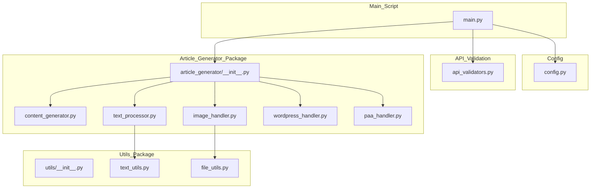

## Main Script Flow

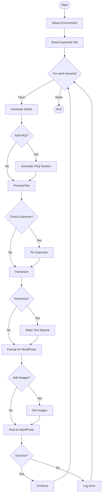

## Content Generation Flow

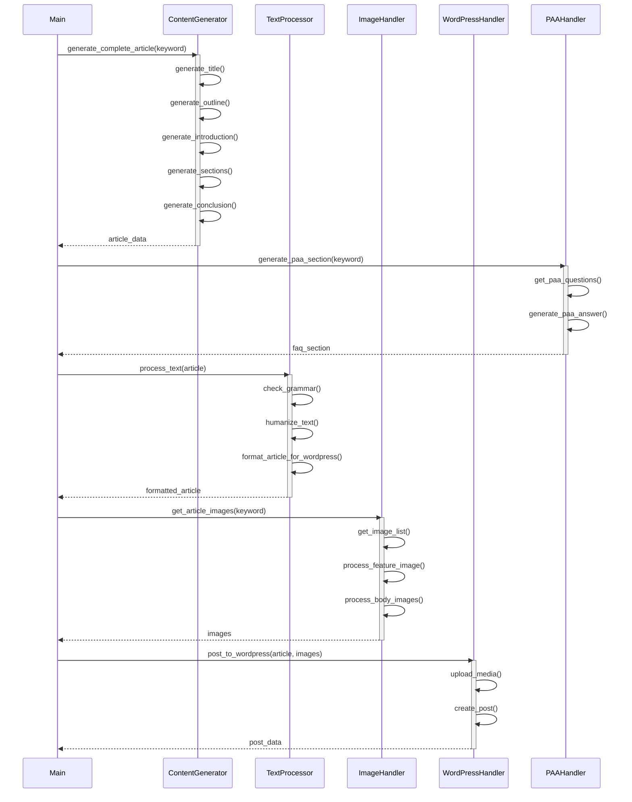

## API Validation Flow

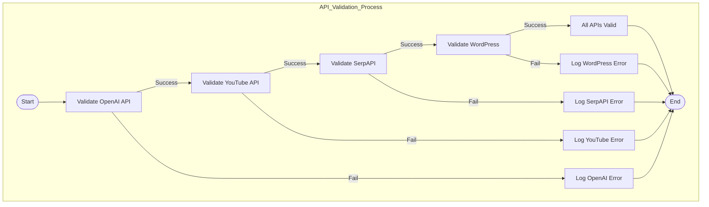

## Text Processing Flow

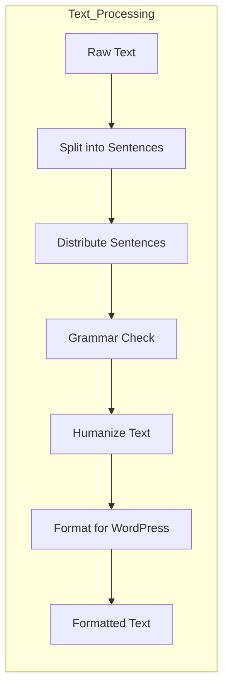

## Image Handling Flow

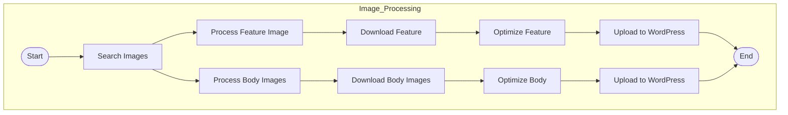

## WordPress Integration Flow

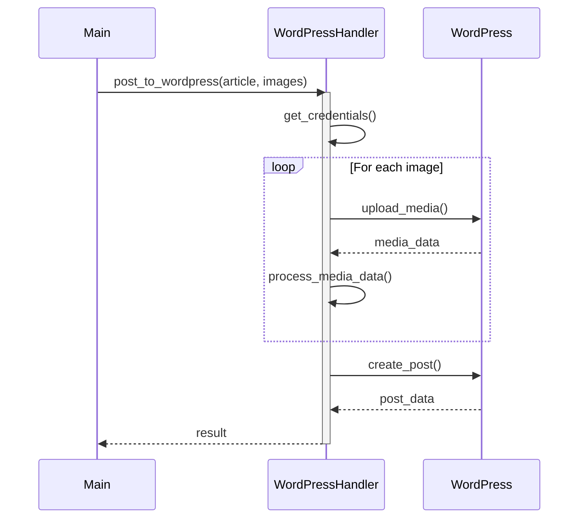

## Function Dependencies

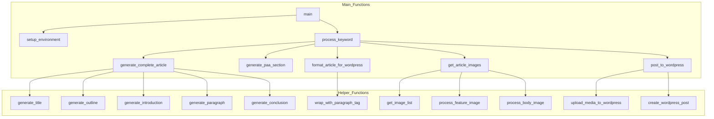

## Error Handling Flow

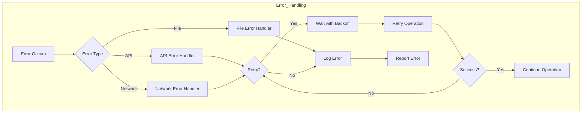

This documentation provides a comprehensive view of how the different components of the article generation system interact with each other. The Mermaid.js diagrams help visualize:

1. Overall system architecture
2. Main script execution flow
3. Content generation process
4. API validation process
5. Text processing pipeline
6. Image handling workflow
7. WordPress integration
8. Function dependencies
9. Error handling mechanisms

Each diagram represents a different aspect of the system, making it easier to understand the flow of data and control between different modules and functions. 

# Article Generation Flow Analysis

## Process Flow with Weakness Points

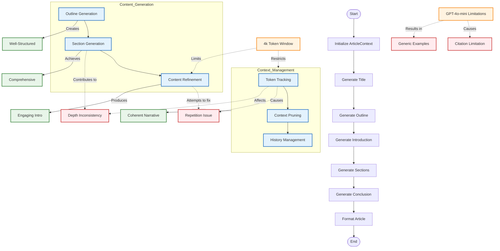

## Analysis of Key Components

### 1. Context Management
- **ArticleContext Class**
  - Manages conversation history
  - Tracks token usage
  - Prunes context when needed
  - Impact on quality:
    * Enables coherent narrative
    * But limited by token window

### 2. Content Generation
- **Outline Generation**
  - Uses temperature=0.7 for creativity
  - Structures article hierarchy
  - Impact on quality:
    * Creates well-organized content
    * But can lead to depth inconsistency

### 3. Token Management
- **Token Window Limitation**
  - 4k token context window
  - Forces context pruning
  - Impact on quality:
    * Causes some repetition
    * Affects content depth

### 4. Model Limitations
- **GPT-4o-mini Constraints**
  - Knowledge cutoff
  - Training data limitations
  - Impact on quality:
    * Generic examples
    * Limited citations

## Improvement Opportunities

1. **Context Management**
   ```python
   def prune_context(self, tokens_needed: int):
       # Current: Removes oldest messages
       # Could: Implement smart pruning based on relevance
   ```

2. **Content Generation**
   ```python
   def generate_section(self, heading: str):
       # Current: Fixed temperature
       # Could: Adaptive temperature based on section type
   ```

3. **Token Management**
   ```python
   def manage_tokens(self):
       # Current: Simple threshold-based
       # Could: Implement sliding window with overlap
   ```

4. **Quality Control**
   ```python
   def validate_content(self):
       # Current: Basic validation
       # Could: Add fact-checking and citation validation
   ```

## Recommendations

1. **Short-term Fixes**
   - Implement smarter context pruning
   - Add section-specific temperature control
   - Enhance token management strategy

2. **Long-term Improvements**
   - Upgrade to larger model when available
   - Add fact-checking capabilities
   - Implement citation management
   - Develop example database 