# RAG Implementation Documentation

## 1. Introduction

This document provides a comprehensive overview of the Retrieval Augmented Generation (RAG) implementation in the article generation system. The RAG system enhances the quality and factual accuracy of generated content by retrieving relevant information from the web and incorporating it into the generation process.

## 2. System Architecture

The RAG implementation consists of several key components:

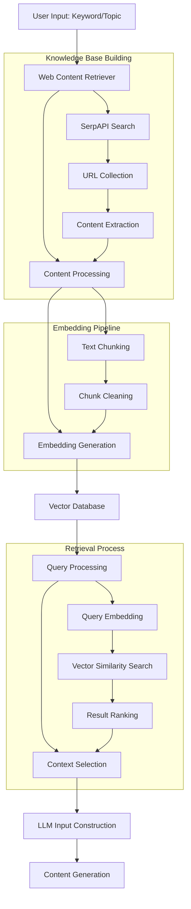

## 3. Component Details

### 3.1 Web Content Retriever

The `WebContentRetriever` class is the cornerstone of the RAG system, responsible for:
- Searching for relevant content using search engines (SerpAPI)
- Extracting content from web pages
- Processing and storing the retrieved information
- Building and querying a knowledge base

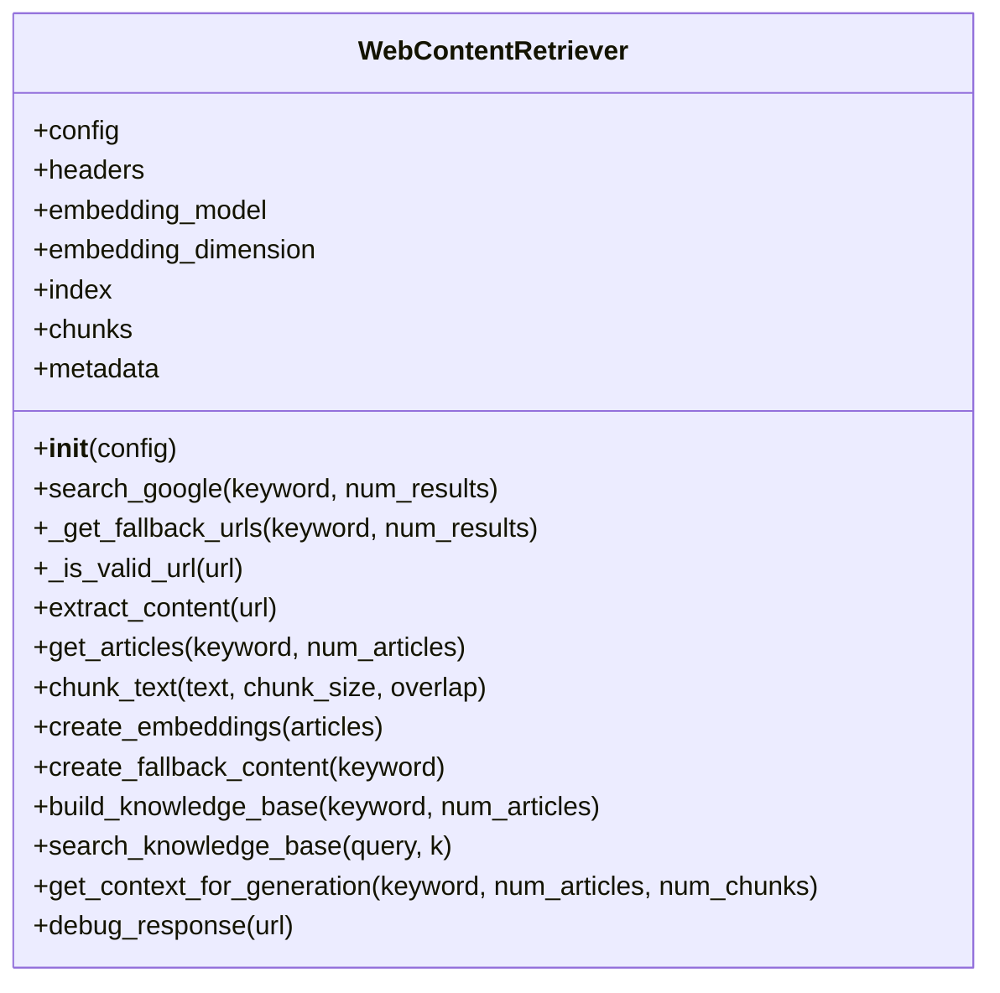

### 3.2 Search Process

The search process uses SerpAPI to obtain reliable and relevant search results:

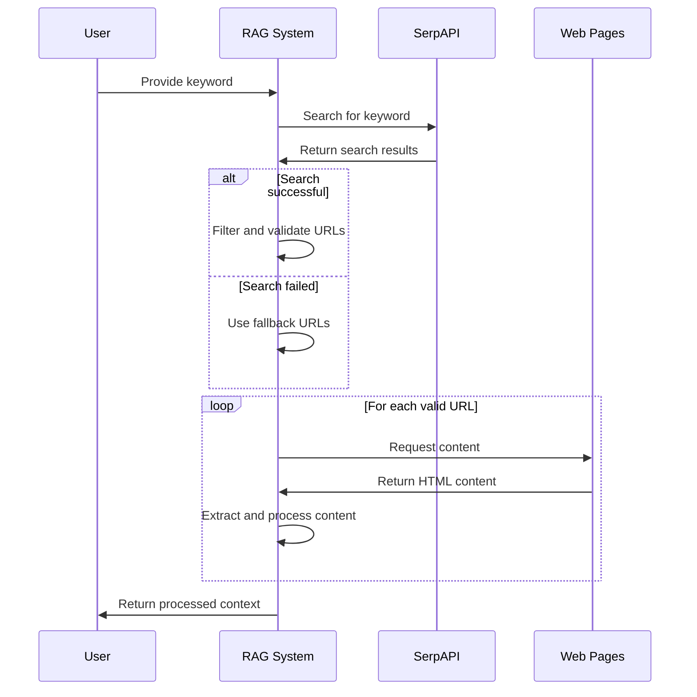

#### 3.2.1 SerpAPI Integration

The system uses SerpAPI to perform Google searches, which provides several advantages:
- Avoids Google's anti-scraping measures
- Provides structured data in JSON format
- Includes additional data like related questions and knowledge graph
- Respects rate limits and terms of service

SerpAPI search parameters:
```
{
    "engine": "google",
    "q": keyword,
    "api_key": config.serp_api_key,
    "gl": "us",
    "hl": "en",
    "num": num_results * 2,
    "safe": "active",
    "google_domain": "google.com",
    "no_cache": true
}
```

### 3.3 Content Extraction

The content extraction process uses multiple strategies to ensure robust content retrieval:

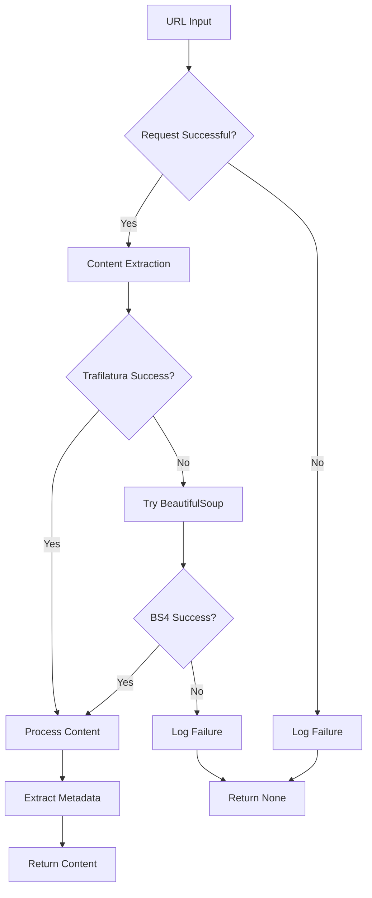

#### 3.3.1 Extraction Methods

1. **Primary Method: Trafilatura**
   - Used for main content extraction
   - Automatically removes boilerplate content
   - Preserves text structure

2. **Fallback Method: BeautifulSoup**
   - Used when Trafilatura fails
   - Applies custom content extraction rules
   - Identifies content containers (article, main, etc.)

3. **Metadata Extraction**
   - Title, author, date information
   - Description and other available metadata
   - Fallback to HTML title when metadata extraction fails

### 3.4 Text Chunking and Embedding

The chunking process breaks down retrieved content into manageable pieces for embedding:

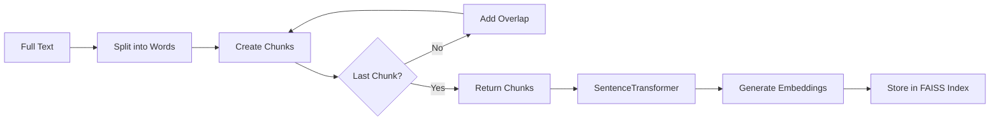

#### 3.4.1 Chunking Parameters

- **Chunk Size**: 200 words (configurable)
- **Overlap**: 50 words (configurable)
- **Strategy**: Sliding window with overlap

#### 3.4.2 Embedding Model

- **Model**: all-MiniLM-L6-v2
- **Dimension**: 384
- **Indexing**: FAISS for efficient similarity search

### 3.5 Knowledge Base Building

The knowledge base construction process follows these steps:

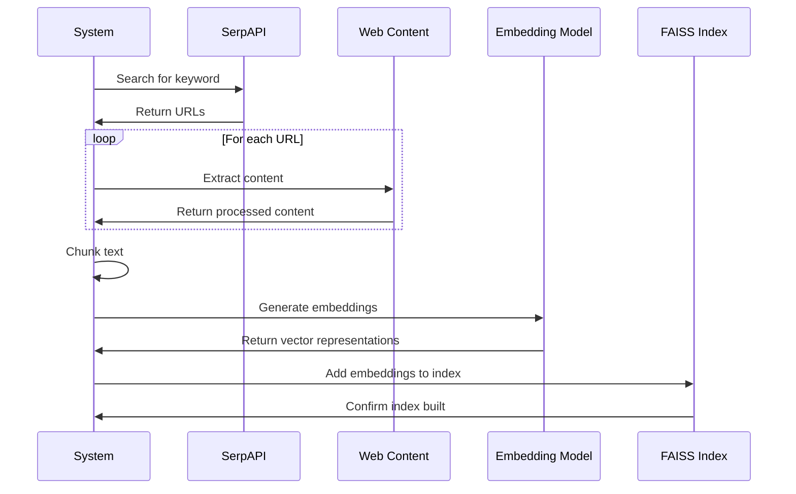

### 3.6 Query Processing and Retrieval

The RAG query process:

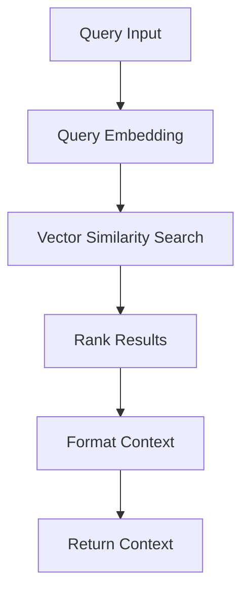

## 4. RAG Integration Flow

The complete RAG flow in the article generation process:

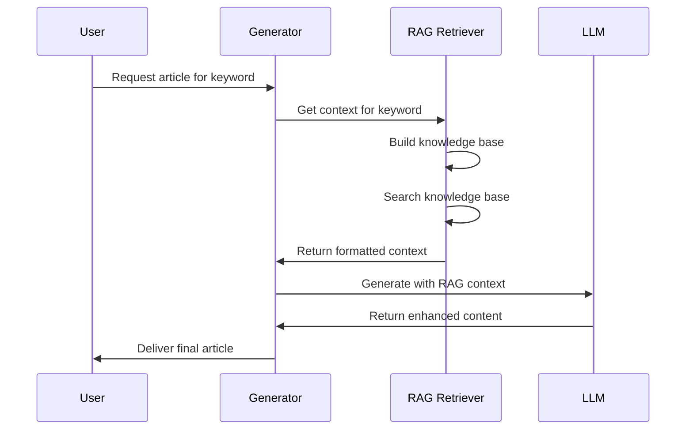

## 5. Error Handling and Fallbacks

The system implements robust error handling and fallback mechanisms:

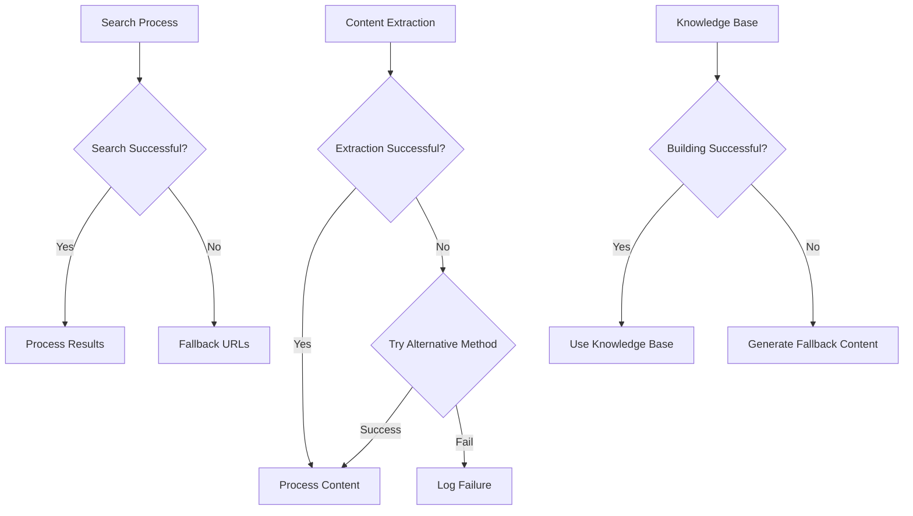

### 5.1 Fallback Content Generation

When web retrieval fails completely, the system creates synthetic content to ensure the RAG process can continue:

```python
def create_fallback_content(keyword: str) -> List[Dict[str, Any]]:
    # Create a basic article with general information about the topic
    title = f"Information about {keyword}"
    
    content = f"""
This is general information about {keyword}. 

When dealing with {keyword}, it's important to understand the basics. 
There are several key aspects to consider.

First, {keyword} requires proper preparation and planning.
Second, having the right tools and resources is essential.
Third, following best practices helps ensure successful outcomes.

Remember to always prioritize safety and ethical considerations when working with {keyword}.
    """
    
    # Create article dictionary
    article = {
        "url": "fallback://synthetic-content",
        "content": content,
        "title": title,
        "author": "System Generated",
        "date": None,
        "description": f"General information about {keyword}",
        "timestamp": time.time()
    }
    
    return [article]
```

## 6. Configuration Options

The RAG system supports several configuration options:

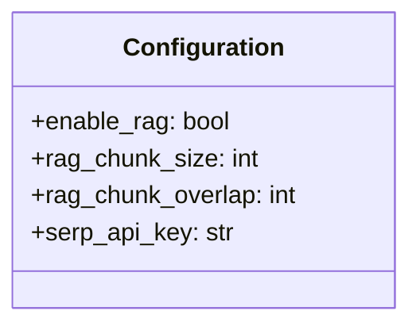

Key configuration parameters:
- `enable_rag`: Toggle RAG functionality on/off
- `rag_chunk_size`: Number of words per chunk
- `rag_chunk_overlap`: Number of overlapping words between chunks
- `serp_api_key`: API key for SerpAPI

## 7. Logging and Monitoring

The system implements comprehensive logging to track RAG performance:

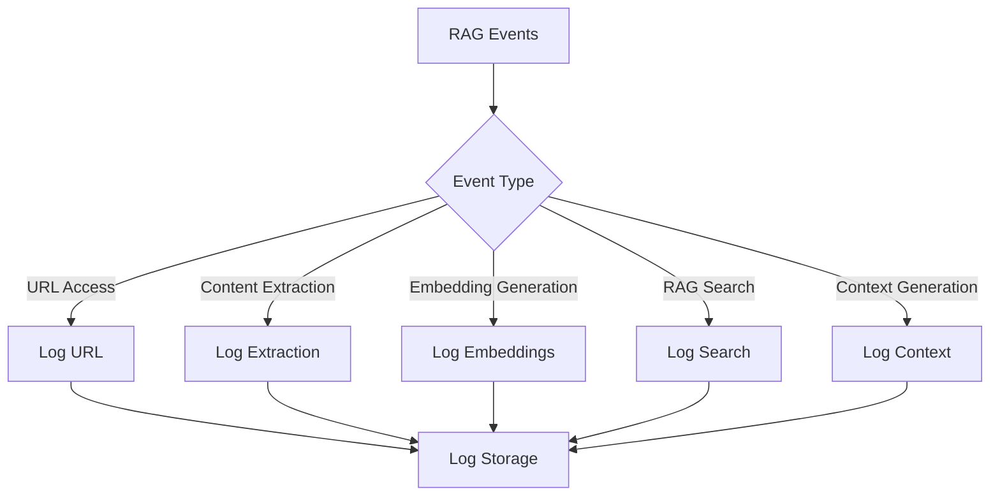

Logged information includes:
- URL access success/failure
- Content extraction metrics
- Embedding generation statistics
- RAG search performance
- Context generation details

## 8. Performance Considerations

The RAG implementation balances several performance considerations:

### 8.1 Response Time vs. Quality

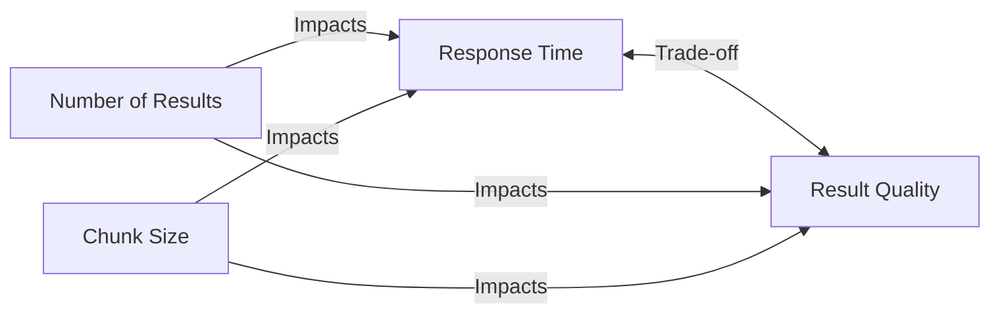

### 8.2 Resource Usage

```mermaid
graph TD
    A[RAM Usage] <-- B[Number of Articles]
    A <-- C[Embedding Model Size]
    D[CPU Usage] <-- E[Vector Search Operations]
    D <-- F[Embedding Generation]
```

## 9. Security and Ethics

The implementation includes several measures to ensure ethical usage:

- Transparent user agent identification
- Respect for robots.txt
- Rate limiting to avoid overloading sites
- Safe search filtering
- Content filtering for inappropriate material

## 10. FAISS Vector Database Integration

The system uses Facebook AI Similarity Search (FAISS) for efficient vector similarity search:

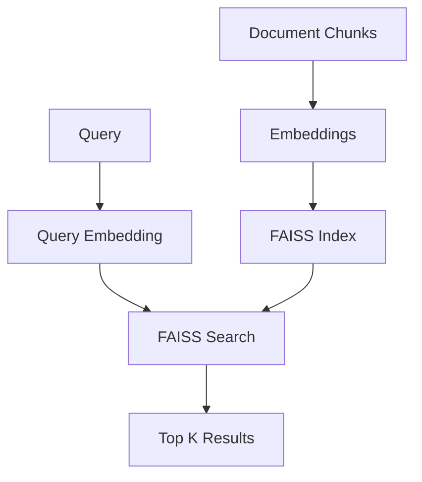

## 11. Data Flow Diagrams

### 11.1 General Data Flow

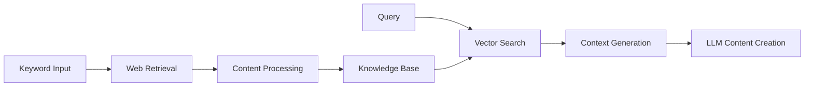

### 11.2 Data Processing Flow

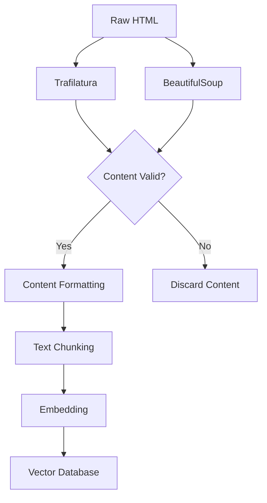

## 12. Usage Example

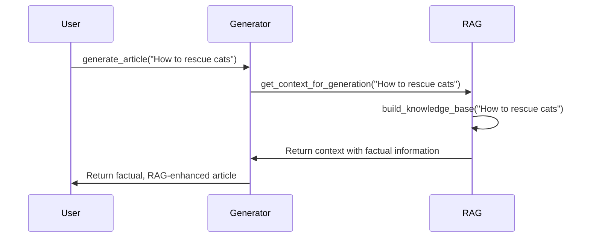

## 13. Troubleshooting

Common issues and their solutions:

1. **Issue**: No search results returned
   **Solution**: Check SerpAPI key validity, use fallback URLs

2. **Issue**: Content extraction failing
   **Solution**: The system automatically tries multiple extraction methods

3. **Issue**: Embedding model failure
   **Solution**: The system falls back to default dimensions and provides warnings

4. **Issue**: Poor quality RAG results
   **Solution**: Adjust chunk size and overlap, increase number of articles

## 14. How to Extend the RAG System

The RAG system can be extended in several ways:

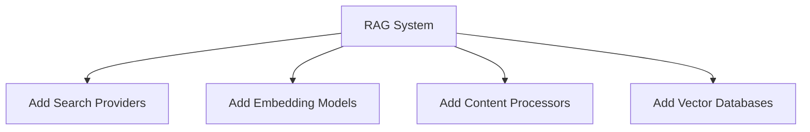

## 15. Conclusion

The RAG implementation significantly enhances content generation by providing factual context from reliable web sources. The modular architecture allows for easy maintenance and extension, while robust error handling ensures the system can operate even when components fail.

By retrieving, processing, and integrating web content into the generation process, the system produces more accurate, informative, and valuable content for users. 