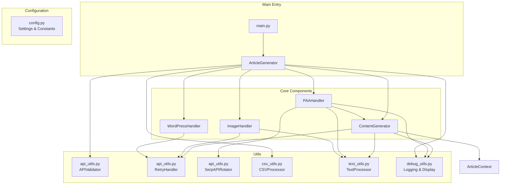
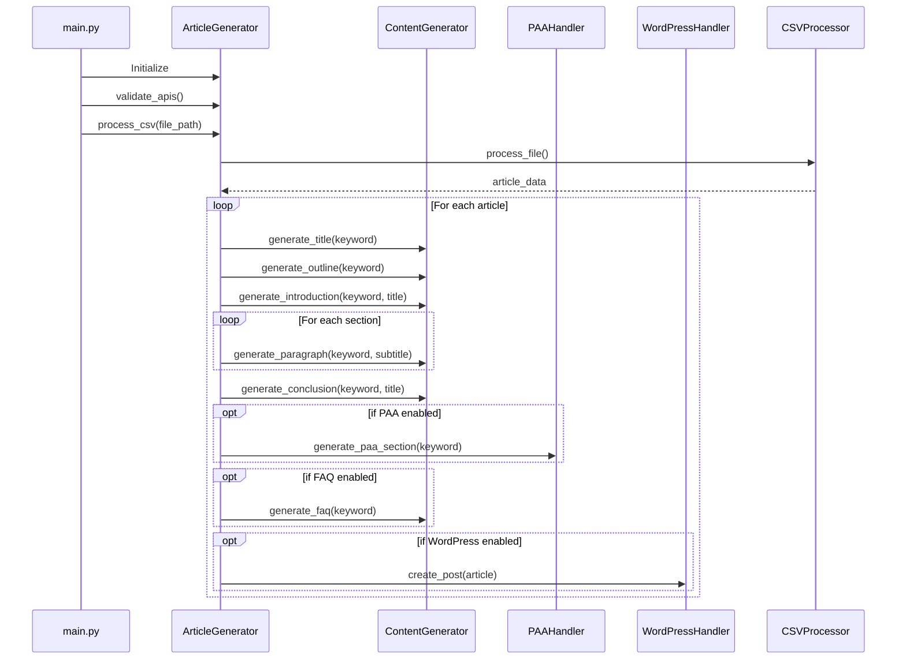
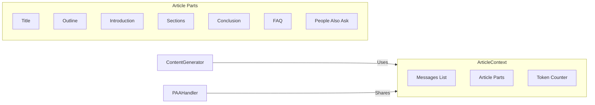
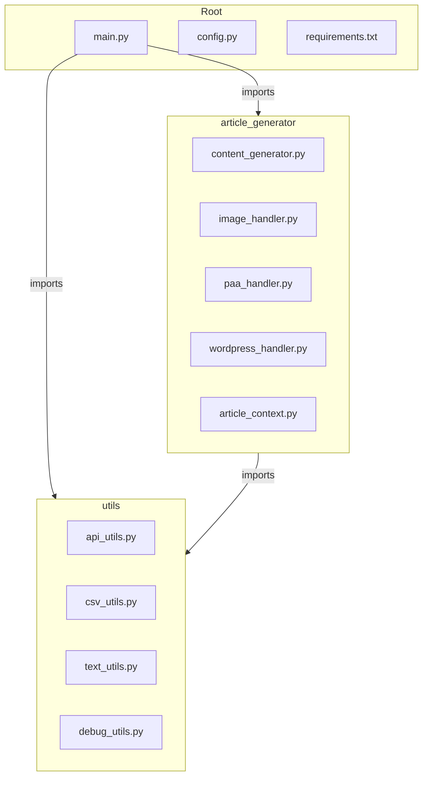
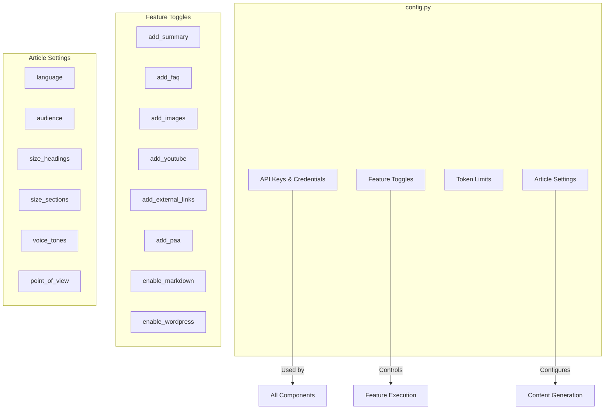
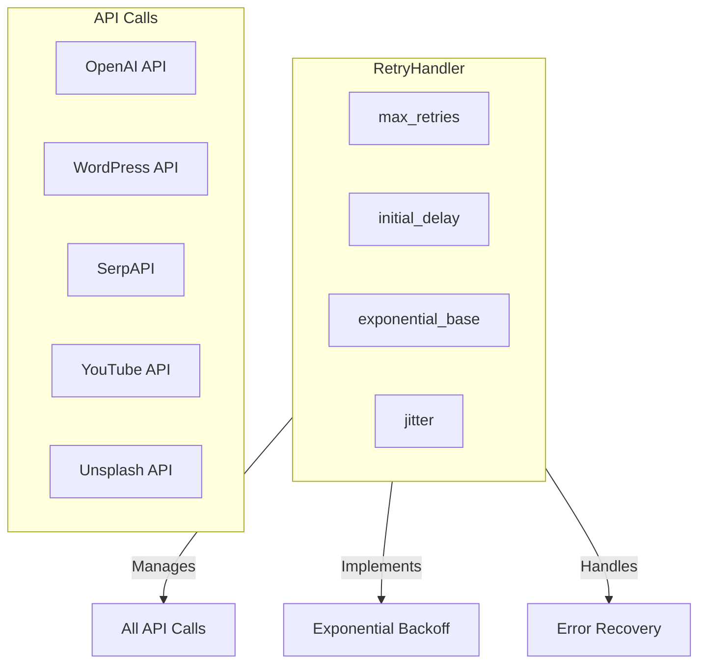

# Script2 Architecture and Flow Documentation

## System Architecture

## Content Generation Flow

## Article Context Management

## File Structure

## Configuration Management

## Error Handling and Retry Logic

This documentation provides a comprehensive overview of how the different components in script2 interact with each other. The diagrams show:

1. Overall system architecture and component relationships
2. Sequential flow of the content generation process
3. How article context is managed and shared
4. File structure and organization
5. Configuration management and feature toggles
6. Error handling and retry mechanisms

Each component is designed to be modular and handle specific responsibilities:
- `ContentGenerator`: Core content generation logic
- `PAAHandler`: Manages "People Also Ask" content
- `ImageHandler`: Handles image processing and optimization
- `WordPressHandler`: Manages WordPress integration
- `ArticleContext`: Maintains context and manages tokens
- Utility classes: Provide supporting functionality 