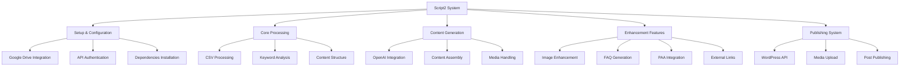
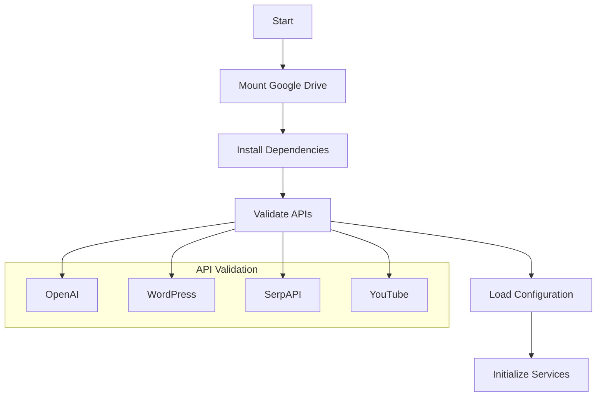
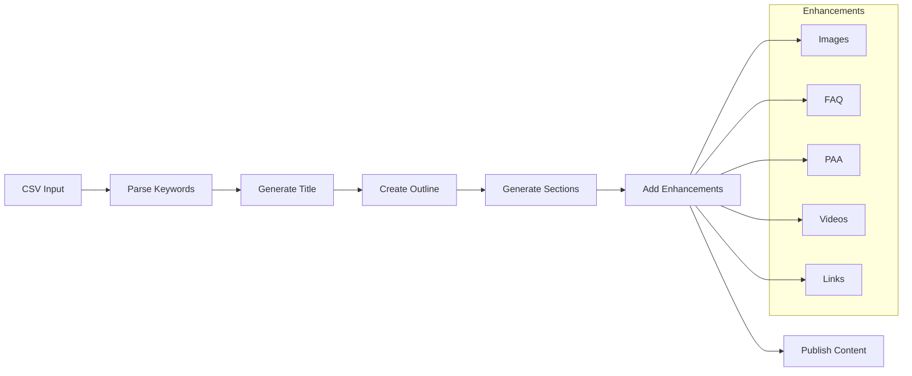
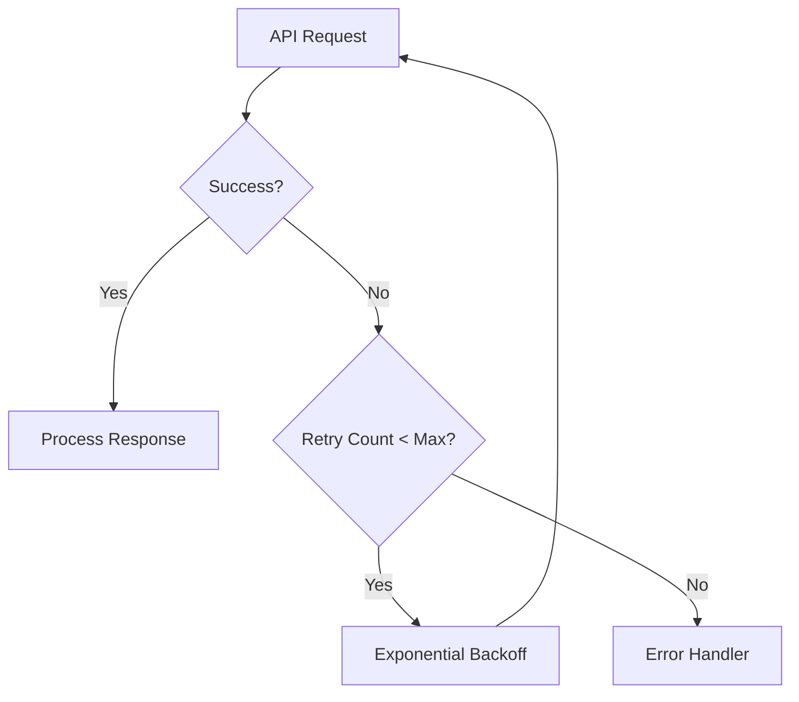

# بِسْمِ اللهِ الرَّحْمٰنِ الرَّحِيْمِ

# Comprehensive Analysis of Script2: AI-Powered Article Generation System

## 1. System Architecture Overview



## 2. Core Components

### 2.1 Dependencies and APIs
- **OpenAI API**: Content generation engine
- **WordPress REST API**: Publishing platform
- **PyUnsplash**: Image sourcing
- **SerpAPI**: Search results and PAA questions
- **YouTube Data API**: Video content integration
- **NLTK**: Natural language processing
- **Google Drive**: File storage and management

### 2.2 Key Configuration Options
```python
# Content Enhancement Flags
add_summary_into_article = True
add_faq_into_article = True
add_image_into_article = True
add_youtube_video_into_article = True
add_external_links_into_article = True
add_PAA_paraphraps_into_article = True
add_blocknote_into_article = True

# Content Style Options
articlelanguage = "English"
articleaudience = "general wide used"
sizeheadings = 3  # 1-15 headings
sizesections = 3  # 1-5 sections per paragraph
```

## 3. Process Flow

### 3.1 Initialization Phase


### 3.2 Content Generation Pipeline


## 4. Key Functions and Components

### 4.1 Content Generation
- `generateTitle()`: Creates engaging, SEO-optimized titles
- `generateOutline()`: Structures article framework
- `generateIntroduction()`: Creates hook and context
- `generateParagraph()`: Produces section content
- `generateConclusion()`: Summarizes and closes article

### 4.2 Enhancement Features
- `summary_text()`: Article summary generation
- `paa_fun()`: People Also Ask section
- `youtubevid()`: YouTube video embedding
- `image_operation_unsplash()`: Image sourcing and processing
- `serp()`: External link generation

### 4.3 WordPress Integration
- `feature_image()`: Featured image handling
- `body_img()`: In-content image placement
- Post creation and publishing via REST API

## 5. Error Handling and Retry Logic



## 6. Data Flow and Processing

### 6.1 CSV Structure
```csv
keyword,featured_img,subtitle1,img1,subtitle2,img2,...
hiking,mountain,gear,backpack,safety,compass,...
```

### 6.2 Content Assembly
1. Parse CSV input
2. Generate article components
3. Enhance with media and additional content
4. Format for WordPress
5. Publish via REST API

## 7. Best Practices and Optimization

### 7.1 API Usage
- Implement rate limiting
- Use exponential backoff
- Rotate API keys for load distribution
- Cache responses where appropriate

### 7.2 Content Quality
- Natural language processing
- Grammar and readability checks
- SEO optimization
- Media enhancement

### 7.3 Error Prevention
- Input validation
- API health checks
- Retry mechanisms
- Fallback options

## 8. System Requirements

### 8.1 Environment
- Python 3.x
- Google Colab/Drive integration
- Active internet connection
- Sufficient API quotas

### 8.2 API Keys
- OpenAI API key
- WordPress credentials
- SerpAPI key
- YouTube API key
- Unsplash API key

## 9. Monitoring and Maintenance

### 9.1 Health Checks
- API quota monitoring
- Error rate tracking
- Content quality assessment
- Performance metrics

### 9.2 Optimization Opportunities
- Content caching
- Batch processing
- Rate limit management
- Resource utilization

## 10. Future Enhancements

### 10.1 Potential Improvements
- Advanced error recovery
- Content quality metrics
- A/B testing capability
- Enhanced media processing
- Automated SEO optimization

### 10.2 Scalability Considerations
- Distributed processing
- Load balancing
- Resource optimization
- Performance monitoring