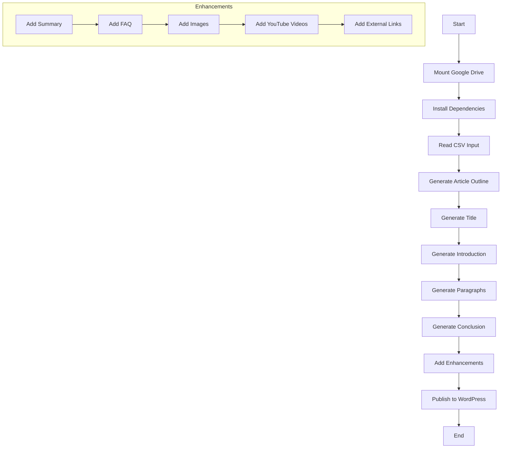

# بِسْمِ اللهِ الرَّحْمٰنِ الرَّحِيْمِ

## Overview of `script2_converted.py`

This document provides a detailed explanation of the `script2_converted.py` script, including its functionality, dependencies, and the flow of operations. The script is designed to automate the generation and publishing of articles using AI, specifically in a Google Colab environment with Google Drive integration.

### Dependencies and Libraries

The script utilizes several Python libraries and APIs, including:

- **Google Colab and Drive**: For mounting and accessing files from Google Drive.
- **OpenAI API**: For generating text content using AI models.
- **PyUnsplash**: For fetching images from Unsplash.
- **Google Search Results (SerpAPI)**: For fetching search results and related questions.
- **YouTube Data API**: For fetching related YouTube videos.
- **Requests**: For making HTTP requests to various APIs.
- **PIL (Pillow)**: For image processing.
- **NLTK**: For natural language processing tasks.
- **CSV**: For reading and processing CSV files.

### Flow of Operations

### Detailed Explanation

1. **Mount Google Drive**: The script begins by mounting Google Drive to access necessary files and directories.

2. **Install Dependencies**: It installs required Python libraries into a custom directory within Google Drive.

3. **Read CSV Input**: The script reads a CSV file containing structured article data. Each row represents an article with various components like keywords and image references.

4. **Generate Article Outline**: Using OpenAI's API, the script generates an outline for the article based on the provided keywords.

5. **Generate Title**: A compelling title is generated for the article using AI.

6. **Generate Introduction**: The script creates an engaging introduction to hook the reader.

7. **Generate Paragraphs**: For each section of the article, paragraphs are generated using AI, incorporating the specified keywords and subheadings.

8. **Generate Conclusion**: A conclusion is crafted to summarize the article and provide closure.

9. **Add Enhancements**: Optional enhancements are added to the article, including summaries, FAQs, images, YouTube videos, and external links.

10. **Publish to WordPress**: The final article is published to a WordPress site using the WordPress REST API.

11. **End**: The script completes its execution.

### Key Features and Considerations

- **API Rate Limits**: The script includes retry logic to handle API rate limits.
- **Error Handling**: Various checks and error handling mechanisms are in place to ensure smooth execution.
- **Customization**: The script allows for customization of article tone, structure, and additional content.

This flowchart and explanation provide a comprehensive overview of the `script2_converted.py` script, detailing its operations and dependencies. 