# بِسْمِ اللهِ الرَّحْمٰنِ الرَّحِيْمِ
# Script 2: CSV-Based Article Generation Flow Analysis

## 1. System Architecture

```mermaid
graph TD
    %% Main Process Flow
    Start([Start]) --> CoLab[Initialize Google Colab]
    CoLab --> MountDrive[Mount Google Drive]
    MountDrive --> InstallDeps[Install Dependencies]
    InstallDeps --> ValidateAPI[Validate APIs]
    ValidateAPI --> ReadCSV[Read CSV Input]
    ReadCSV --> ProcessKeywords[Process Keywords]
    ProcessKeywords --> End([End])

    %% Dependencies Installation
    subgraph Dependencies
        InstallDeps --> BS4[BeautifulSoup4]
        InstallDeps --> PyUnsplash[PyUnsplash]
        InstallDeps --> SerpAPI[SerpAPI Client]
        InstallDeps --> NLTK[NLTK]
        InstallDeps --> OpenAI[OpenAI]
        InstallDeps --> HTTPX[HTTPX]
    end

    %% API Validation
    subgraph API_Checks
        ValidateAPI --> CheckOpenAI[OpenAI API]
        ValidateAPI --> CheckYouTube[YouTube API]
        ValidateAPI --> CheckSerpAPI[SerpAPI]
        ValidateAPI --> CheckUnsplash[Unsplash API]
    end

    %% CSV Processing
    subgraph CSV_Handling
        ReadCSV --> ValidateStructure[Validate CSV Structure]
        ValidateStructure --> ExtractColumns[Extract Columns]
        ExtractColumns --> MapContent[Map Content Structure]
    end

    classDef setup fill:#000000,stroke:#000000,stroke-width:2px;
    classDef process fill:#000000,stroke:#000000,stroke-width:2px;
    classDef api fill:#000000,stroke:#000000,stroke-width:2px;
    
    class Start,End setup;
    class CoLab,MountDrive,InstallDeps process;
    class ValidateAPI,CheckOpenAI,CheckYouTube,CheckSerpAPI,CheckUnsplash api;
```



## 2. CSV Structure and Processing

```mermaid
graph TD
    %% CSV Structure
    CSV[CSV File] --> Headers[Headers Processing]
    Headers --> Columns[Column Extraction]
    
    %% Column Types
    Columns --> MainKeyword[Main Keyword]
    Columns --> FeaturedImg[Featured Image]
    Columns --> Subtitles[Subtitles]
    Columns --> SectionImgs[Section Images]
    
    %% Content Mapping
    MainKeyword --> ContentGen[Content Generation]
    FeaturedImg --> ImgSearch[Image Search]
    Subtitles --> SectionGen[Section Generation]
    SectionImgs --> ImgPlacement[Image Placement]
    
    %% Validation
    subgraph Validation
        ValidateFormat[Format Check]
        ValidateReqs[Requirements Check]
        ValidateRefs[Reference Check]
    end
    
    CSV --> Validation
    
    classDef csv fill:#000000,stroke:#000000,stroke-width:2px;
    classDef process fill:#000000,stroke:#000000,stroke-width:2px;
    classDef content fill:#000000,stroke:#000000,stroke-width:2px;
    
    class CSV,Headers,Columns csv;
    class ContentGen,ImgSearch,SectionGen,ImgPlacement process;
    class MainKeyword,FeaturedImg,Subtitles,SectionImgs content;
```



## 3. Content Generation Process

```mermaid
graph TD
    %% Main Content Flow
    Start([Start]) --> Title[Generate Title]
    Title --> Outline[Generate Outline]
    Outline --> Sections[Generate Sections]
    
    %% Section Processing
    Sections --> Section1[Section 1]
    Sections --> Section2[Section 2]
    Sections --> SectionN[Section N]
    
    %% Image Integration
    Section1 --> Img1[Image 1]
    Section2 --> Img2[Image 2]
    SectionN --> ImgN[Image N]
    
    %% Content Assembly
    Img1 --> Assembly[Content Assembly]
    Img2 --> Assembly
    ImgN --> Assembly
    
    %% Enhancement Features
    Assembly --> Features[Enhancement Features]
    
    subgraph Enhancements
        FAQ[FAQ Generation]
        PAA[People Also Ask]
        YouTube[YouTube Videos]
        Links[External Links]
    end
    
    Features --> Enhancements
    
    %% Final Processing
    Assembly --> Format[WordPress Formatting]
    Format --> Publish[Publish]
    
    classDef gen fill:#000000,stroke:#000000,stroke-width:2px;
    classDef img fill:#000000,stroke:#000000,stroke-width:2px;
    classDef enhance fill:#000000,stroke:#000000,stroke-width:2px;
    
    class Title,Outline,Sections gen;
    class Img1,Img2,ImgN img;
    class FAQ,PAA,YouTube,Links enhance;
```



## 4. Function Call Flow

```mermaid
graph TD
    %% Main Functions
    Main[main.py] --> ValidateCSV[validate_and_extract_keywords]
    ValidateCSV --> ProcessKeyword[process_keyword_file]
    
    %% Content Generation
    ProcessKeyword --> GenTitle[generateTitle]
    ProcessKeyword --> GenOutline[generateOutline]
    ProcessKeyword --> GenIntro[generateIntroduction]
    ProcessKeyword --> GenPara[generateParagraph]
    
    %% API Calls
    subgraph API_Calls
        GPT[gpt3_completion]
        Unsplash[image_operation_unsplash]
        YouTube[youtubevid]
        SERP[serp]
    end
    
    GenTitle --> GPT
    GenOutline --> GPT
    GenIntro --> GPT
    GenPara --> GPT
    
    %% Enhancement Functions
    ProcessKeyword --> GetImages[img_list]
    ProcessKeyword --> GetVideos[youtubevid]
    ProcessKeyword --> GetLinks[serp]
    ProcessKeyword --> GetPAA[paa_fun]
    
    GetImages --> Unsplash
    GetVideos --> YouTube
    GetLinks --> SERP
    
    classDef main fill:#000000,stroke:#000000,stroke-width:2px;
    classDef gen fill:#000000,stroke:#000000,stroke-width:2px;
    classDef api fill:#000000,stroke:#000000,stroke-width:2px;
    
    class Main,ProcessKeyword main;
    class GenTitle,GenOutline,GenIntro,GenPara gen;
    class GPT,Unsplash,YouTube,SERP api;
```



## 5. Key Components

### CSV Structure
```csv
Keyword,Featured_img,Subtitle1,img1,Subtitle2,img2,...
hiking,mountain,gear,backpack,safety,compass,...
```

### Content Generation Functions
```python
def generateTitle(keyword):
    # Generate engaging title
    return gpt3_completion(prompt)

def generateOutline(keyword):
    # Generate structured outline
    return gpt3_completion(prompt)

def generateParagraph(bodyimg, keyword, subtitle):
    # Generate section content with image
    return gpt3_completion(prompt)
```

### Image Handling
```python
def image_operation_unsplash(command, photo_number):
    # Get specific image for section
    return image_data

def body_img(command, photo_number):
    # Format image for article body
    return formatted_image
```

### Enhancement Features
```python
def summary_text(keyword):
    # Generate article summary
    return summary

def youtubevid(keyword):
    # Find relevant YouTube video
    return video_embed

def paa_fun(keyword):
    # Generate People Also Ask section
    return paa_content
```

## 6. Process Breakdown

1. **Initial Setup**
   - Mount Google Drive
   - Install dependencies
   - Validate API keys

2. **CSV Processing**
   - Read CSV file
   - Validate structure
   - Extract content mapping

3. **Content Generation**
   - Generate title and outline
   - Create sections with images
   - Add enhancement features

4. **Media Integration**
   - Process images from Unsplash
   - Add YouTube videos
   - Include external links

5. **WordPress Publishing**
   - Format content
   - Upload media
   - Publish article

## 7. Key Differences from Script 1

1. **Structure**
   - More rigid content structure
   - Predefined section-image mapping
   - CSV-based content planning

2. **Environment**
   - Google Colab integration
   - Drive-based library management
   - Simplified dependency handling

3. **Content Flow**
   - Section-first approach
   - Image-centric content
   - Structured enhancement features

4. **API Usage**
   - Direct API calls
   - Simplified token management
   - Less context preservation 