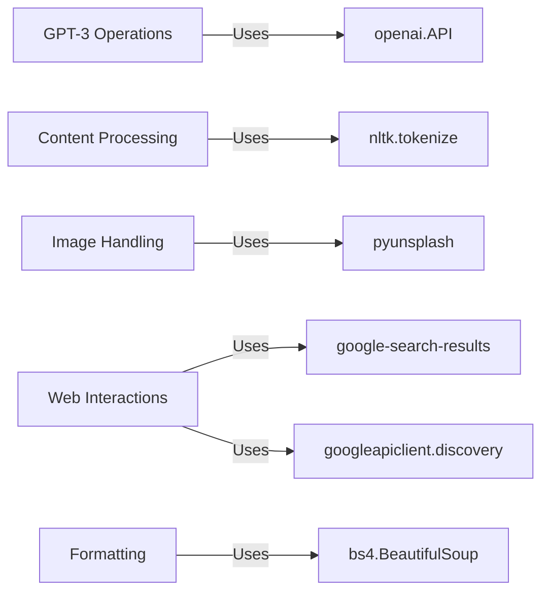
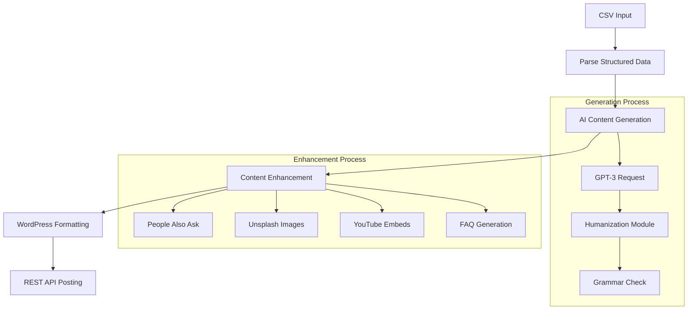
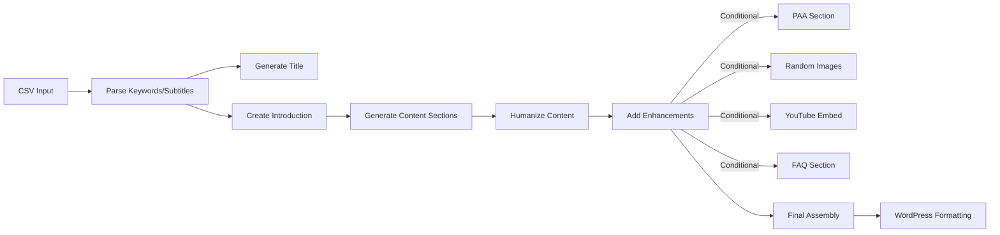
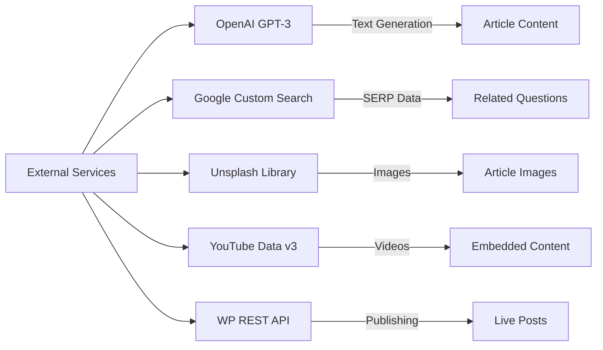
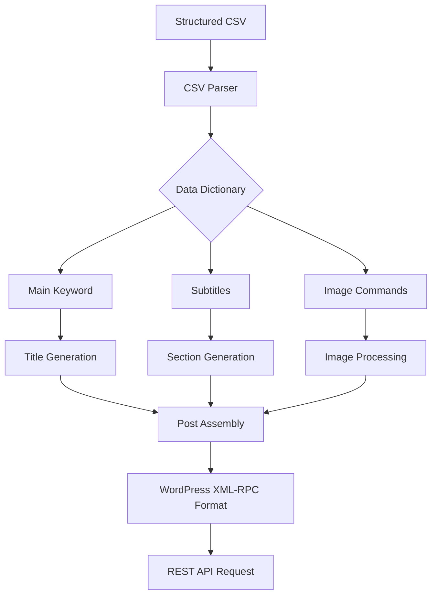
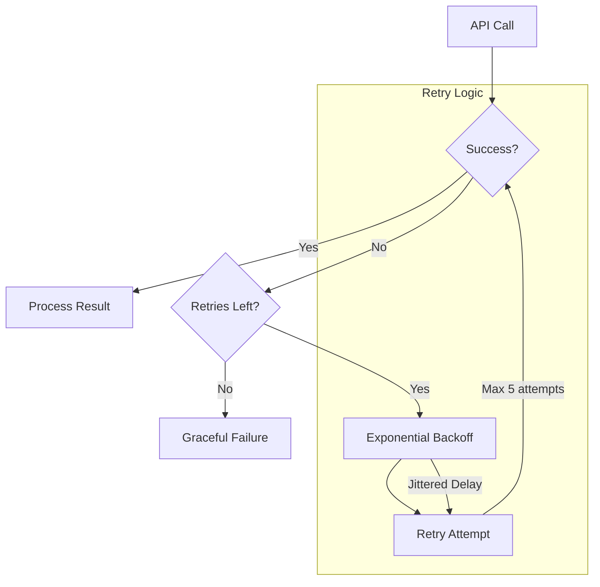
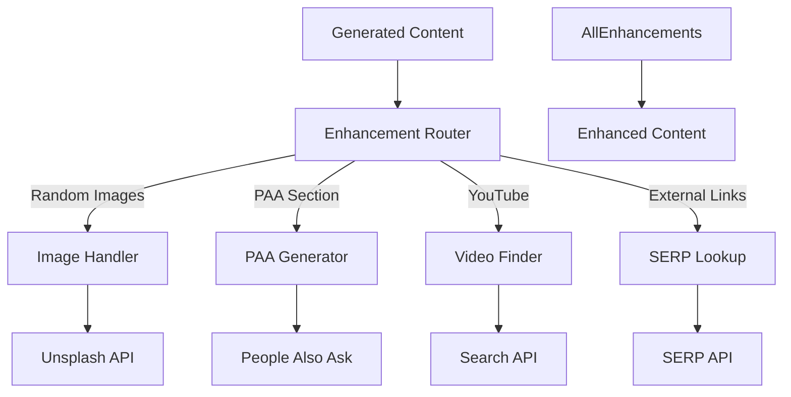
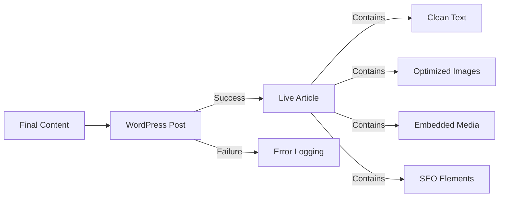

# بِسْمِ اللهِ الرَّحْمٰنِ الرَّحِيْمِ

```mermaid
flowchart TD
    A[Script2: AI-Powered Article Generator] --> B[Google Drive Mount]
    A --> C[Dependencies Installation]
    A --> D[Core Modules]
    A --> E[Workflow]
    A --> F[Output Handling]
    
    B --> B1[Authorization]
    B --> B2[File Access]
    
    C --> C1[openai]
    C --> C2[bs4]
    C --> C3[pyunsplash]
    C --> C4[google-search-results]
    C --> C5[nltk]
    C --> C6[people_also_ask]
    C --> C7[requests]
    C --> C8[random]
    
    D --> D1[Humanization Engine]
    D --> D2[GPT-3 Interface]
    D --> D3[Content Enhancer]
    D --> D4[WordPress Publisher]
    D --> D5[PAA Generator]
    
    E --> E1[CSV Input]
    E --> E2[Content Generation]
    E --> E3[Content Enhancement]
    E --> E4[Post Assembly]
    E --> E5[WordPress Integration]
```

## Core Package Architecture

## Main Workflow Breakdown

## Key Dependency Matrix

| Package               | Usage                                | Critical Functions                 |
|-----------------------|--------------------------------------|-------------------------------------|
| `openai`              | GPT-3 API interactions               | gpt3Request, generate_paragraph    |
| `pyunsplash`          | Unsplash image retrieval             | image_operation_unsplash           |
| `google-search-results` | SERP data collection               | serp, get_paa_questions            |
| `people_also_ask`     | Related question generation          | paa_fun, paaBreak                  |
| `nltk`                | Text processing                      | split_text_into_sentences          |
| `requests`            | WordPress REST API communication     | Post article to WP                 |
| `bs4`                 | HTML content cleaning                | Format generated content           |

## Content Generation Flow

## Critical API Services

## Data Flow Diagram

## Error Handling Mechanism

## Content Enhancement Subsystem

## Conclusion Flow

# Key Technical Components

1. **Natural Language Processing**
   - GPT-3 API for content generation
   - NLTK for sentence tokenization
   - Custom humanization algorithms

2. **Media Handling**
   - Unsplash image integration
   - YouTube video embedding
   - Random image position logic

3. **Content Enhancement**
   - People Also Ask (PAA) section generator
   - Automated FAQ builder
   - SERP-based external links

4. **WordPress Integration**
   - REST API posting
   - Featured media handling
   - Slug generation from keywords

5. **Error Handling**
   - Exponential backoff retry logic
   - Graceful API failure handling
   - Content validation checks

# Critical Dependencies

- **AI Services**: OpenAI API, Google PAA
- **Media Services**: Unsplash API, YouTube API
- **NLP Tools**: NLTK, BeautifulSoup
- **WordPress**: XML-RPC Client, REST API
- **Utility**: Requests, Random, OS, CSV

# Potential Failure Points

1. API Rate Limiting (OpenAI/Google)
2. Media API Authentication Failures
3. CSV Formatting Errors
4. WordPress Connection Issues
5. Content Validation Failures
6. Randomization Logic Errors
